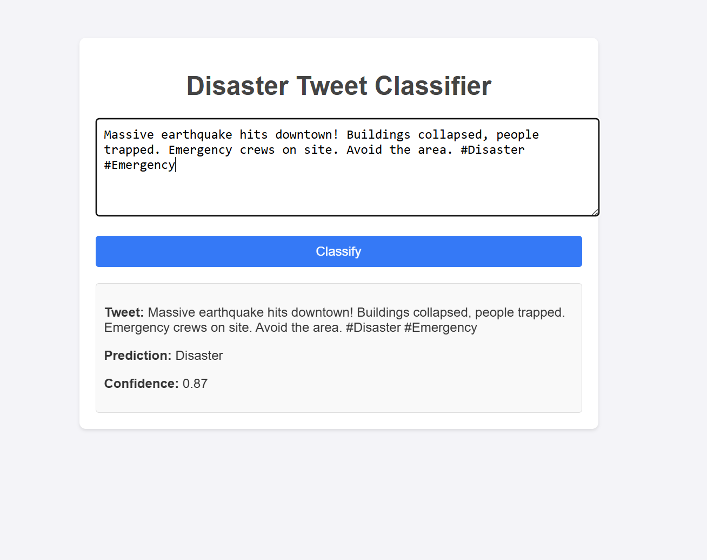

# Mini-Project---Natural-Language-Processing-with-Disaster-Tweets

This is a mini-project for the Natural Language Processing with Disaster Tweets competition on Kaggle. The goal of this project is to build a model that can classify tweets as disaster-related or not.

## Project Structure 
```
data
├── test.csv         # Test data
├── train.csv        # Training data
├── sample_submission.csv # Sample submission file  
models
├── lstm_model.keras         # Model class for training and evaluation
├── tokenizer.pkl            # Tokenizer for text preprocessing
notebooks
├── eda.ipynb                # Exploratory Data Analysis notebook
├── model.ipynb               # LSTM model training notebook
├── utils.py                # Utility functions for data preprocessing and model evaluation
src
├── static   # CSS
├── templates # HTML templates
├── utils # Utility functions for data preprocessing
├── app.py   # Flask application for web interface
Makefile
requirements.txt
README.md
```
## Requirements
- Python 3.6 or higher
- TensorFlow 2.x
- Keras
- Flask
- Pandas
- NumPy
- Scikit-learn
- Matplotlib
- Seaborn
- NLTK

## Installation

```
make install
```

## Usage
1. **Train the model**: Run the `model.ipynb` notebook to train the LSTM model on the training data. The trained model will be saved as `lstm_model.keras`. 

2. **Run the Flask application**: Start the Flask application by running the following command in your terminal:

```bash
python app.py
```

or 
```bash
make run
```

The expected result is a web interface where you can input a tweet and get the prediction of whether it is disaster-related or not.

3. **Make predictions**: You can input a tweet in the web interface and click the "Predict" button to get the prediction. The result will be displayed on the same page.

